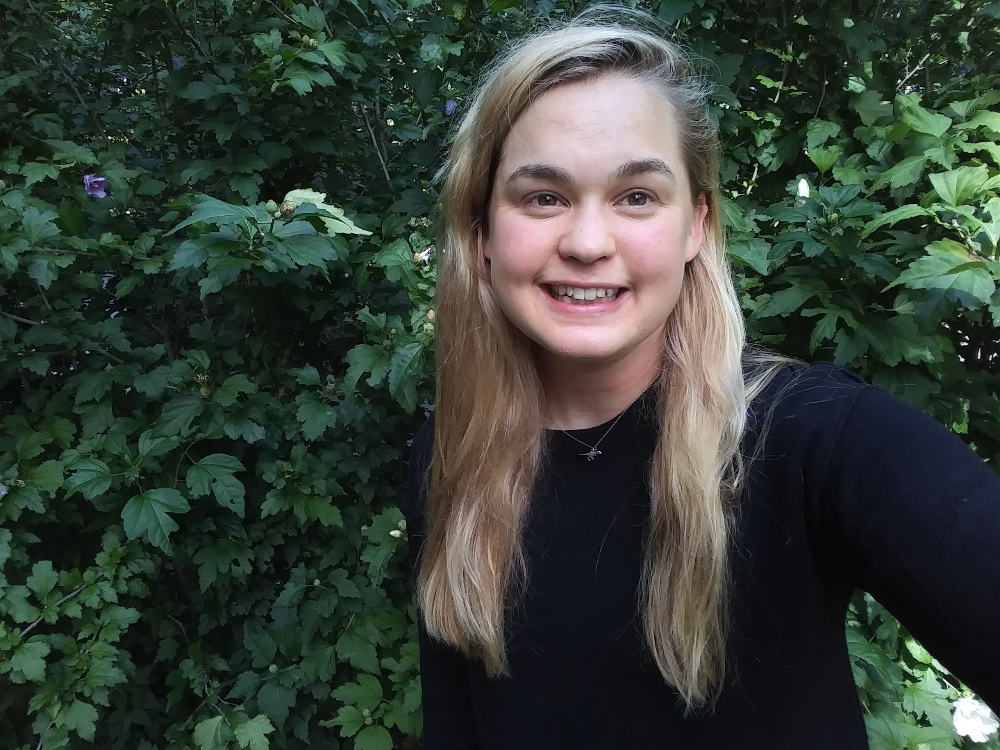
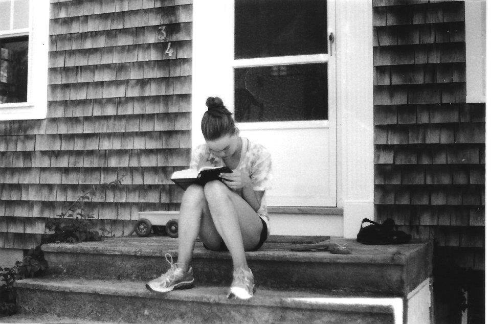

***

I am a graduate student in the  [Department of the Geophysical Sciences](https://geosci.uchicago.edu) at the University of Chicago. I am interested broadly in mammalian phylogenetics, paleobiology and ecomorphology. 
When I'm not working in museum collections, you can find me swimming in Lake Michigan or running along the Lakefront Trail. 

