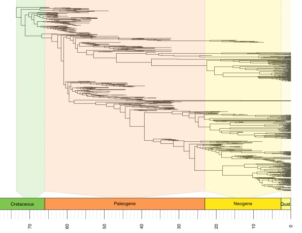
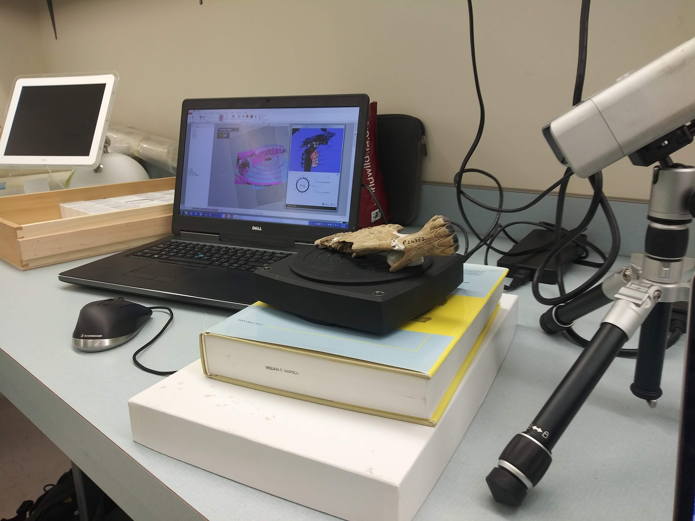

***

Primate phylogenetics and historical biogeography

Large phylogenies are prerequisites for macroevolutionary analyses. We are working on a primate phylogeny that incorporates most, if not all, extinct and 
extant species in a single topology -- well over 800 species. It's a big tree. Analyses of historical biogeography indicate that fossil data are critical for inferring ancestral ranges and dispersal dynamics.

***

Fossil and modern horse phylogenetics and ecomorphology

I am investigating the evolution of dentition and craniomandibular morphology in fossil and modern horses associated with the shift in feeding ecology from browsing to grazing. Along the way, I'll be working on a comprehensive phylogeny for family Equidae.

